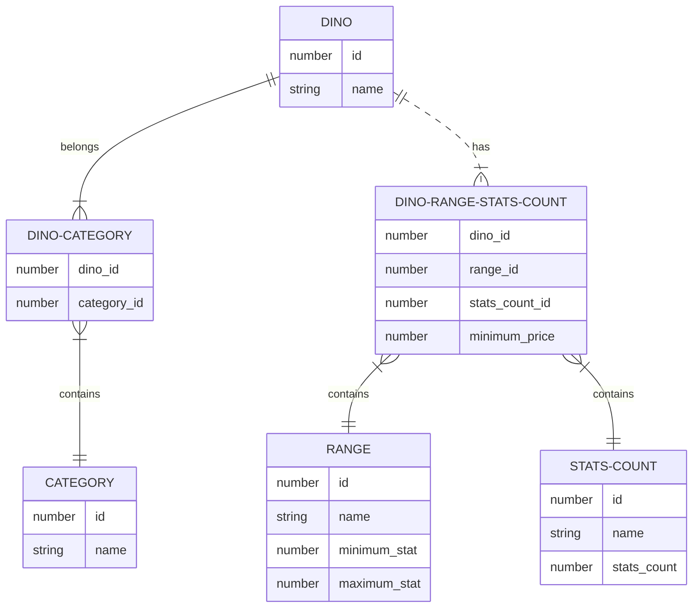

# ACHATINA-DINOS

This project is a discord bot to be used in the Ark: Survival Ascended discord server Achatina BR.

It is designed to help users with information about the dinosaurs and the server's market.

## Commands

### Dinosaurs

- `/dino`: Shows a list of all dinosaurs.
- `/dino <dino_name>`: Shows a list of all dinosaurs that have the name in their name.
- `/range`: Shows a list of ranges of dinosaurs' stats.
- `/range <dino_name>`: Shows the ranges of the dinosaur's stats and minimum price.
- `/range <dino_name> <range>`: Shows the minimum price of the dinosaur's range.
- `/category`: Shows a list of categories of dinosaurs.
- `/category <category>`: Shows a list of dinosaurs in the category.
- `/category <category> <dino_name>`: Shows a list of dinosaurs in the category that have the name in their name.

### Definitions

#### Dino

- `name`: The name of the dinosaur.

#### Range

- `name`: The name of the dinosaur.
- `minimun_stat`: The minimum value of the dinosaur's stat in the range.
- `maximum_stat`: The maximum value of the dinosaur's stat in the range.

##### Values for `range`

- `RANGE_1`:   1 - 59
- `RANGE_2`:  60 - 119
- `RANGE_3`: 120 - 189
- `RANGE_4`: 190 - 224
- `RANGE_5`: 225 - 255

#### Category

- `name`: The name of the category.

#### StatsCount

- `name`: The name of the stat count.

##### Values for `stats_count`

- `STATS_2`: 2 stats in the range
- `STATS_4`: 4 stats in the range

### Entity Relationship Diagram

#### Definition Example - Rex Table

<table>
    <tr>
        <th colspan="6">T-REX - MINIMUM PRICE PER STATS COUNTER AND STATS RANGE</th>
    </tr>
    <tr>
        <th>STATS COUNTER</th>
        <th>RANGE 1 (001-059)</th>
        <th>RANGE 2 (060-119)</th>
        <th>RANGE 3 (120-159)</th>
        <th>RANGE 4 (160-224)</th>
        <th>RANGE 5 (225-255)</th>
   </tr>
    <tr>
        <th>2 STATS</th>
        <th>5.000</th>
        <th>10.000</th>
        <th>15.000</th>
        <th>22.500</th>
        <th>30.000</th>
   </tr>
    <tr>
        <th>4 STATS</th>
        <th>10.000</th>
        <th>20.000</th>
        <th>30.000</th>
        <th>45.000</th>
        <th>60.000</th>
   </tr>
</table>